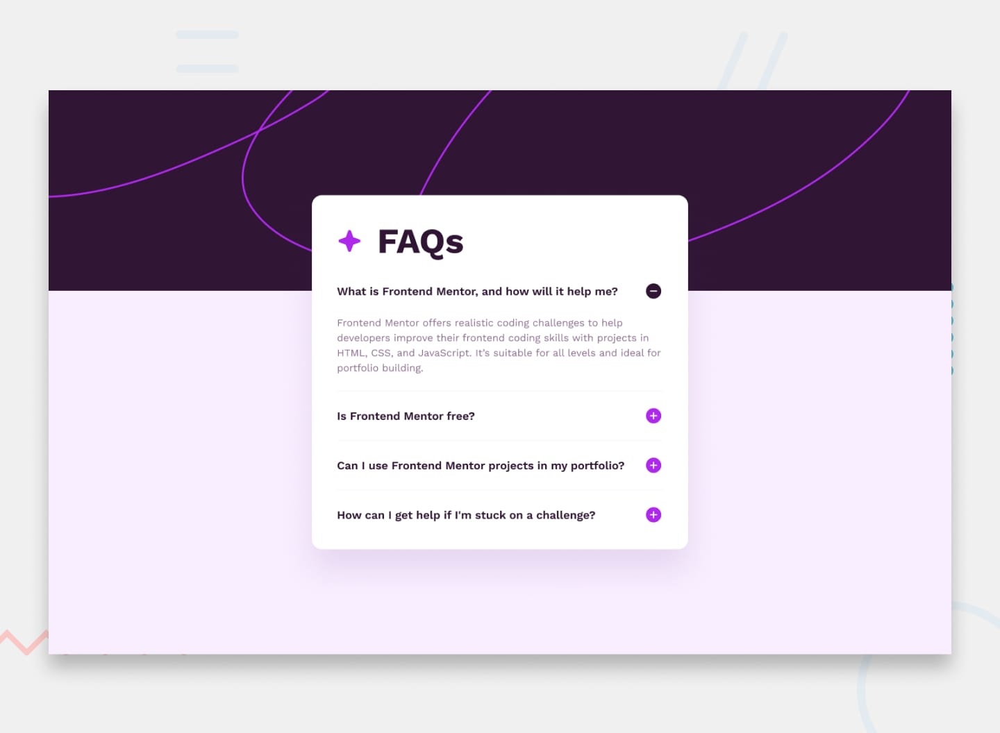

# Frontend Mentor - Solución al FAQ Accordion

Esta es mi solución para el reto [FAQ Accordion de Frontend Mentor](https://www.frontendmentor.io/challenges/faq-accordion-wyfFdeBwBz). Este desafío me ayudó a mejorar mis habilidades en HTML, CSS y JavaScript al crear un acordeón interactivo basado en un diseño específico.

---

## Tabla de Contenidos

- [Descripción General](#descripción-general)
  - [El Desafío](#el-desafío)
  - [Captura de Pantalla](#captura-de-pantalla)
  - [Enlaces](#enlaces)
- [Mi Proceso](#mi-proceso)
  - [Construido Con](#construido-con)
  - [Lo Que Aprendí](#lo-que-aprendí)
  - [Desarrollo Continuo](#desarrollo-continuo)
  - [Recursos Útiles](#recursos-útiles)
- [Autor](#autor)

---

## Descripción General

### El Desafío

Los usuarios deben poder:

- Mostrar/ocultar la respuesta de una pregunta al hacer clic en la misma.
- Ver un diseño optimizado para dispositivos móviles y de escritorio.
- Observar estados de interacción (hover y focus) en todos los elementos interactivos.

### Captura de Pantalla

### Enlaces

- **URL de la Solución**: [Mi solución](https://tu-url-de-solucion.com)
- **URL del Sitio en Vivo**: [Sitio en vivo](https://tu-url-de-sitio.com)

---

## Mi Proceso

### Construido Con

- Marcado semántico HTML5.
- CSS para el diseño, incluyendo Flexbox y propiedades personalizadas.
- JavaScript Vanilla para la funcionalidad interactiva.
- Flujo de trabajo *mobile-first*.

### Lo Que Aprendí

Este proyecto me ayudó a:

- Implementar la funcionalidad de acordeón para expandir o colapsar contenido.
- Crear transiciones suaves para una mejor experiencia de usuario.
- Diseñar una interfaz completamente responsiva que se adapta a dispositivos de diferentes tamaños.
- Manipular imágenes de forma dinámica para reflejar cambios en el estado de los elementos interactivos.

### Desarrollo Continuo

En proyectos futuros, quiero seguir mejorando en:

- La creación de animaciones fluidas y eficientes.
- El uso de mejores prácticas para la accesibilidad, como navegación por teclado.
- Experimentar con frameworks modernos para componentes dinámicos.

### Recursos Útiles

- Documentación y tutoriales en línea para aprender conceptos como Flexbox y manipulación del DOM.
- Comunidad de Frontend Mentor, que ofrece retroalimentación útil para mejorar la solución.

---

## Autor

- **Perfil en Frontend Mentor**: [@DahianaMunoz](https://www.frontendmentor.io/profile/tuusuario)
- **GitHub**: [DahianaMuñoz](https://github.com/tuusuario)

---

Completar este proyecto fue una gran experiencia, y me siento emocionada de aplicar lo que aprendí en futuros retos. ¡Gracias por tomarte el tiempo de revisar mi solución! 😊